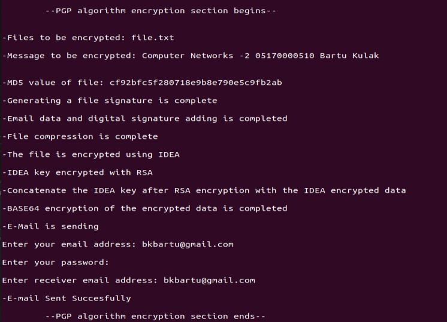
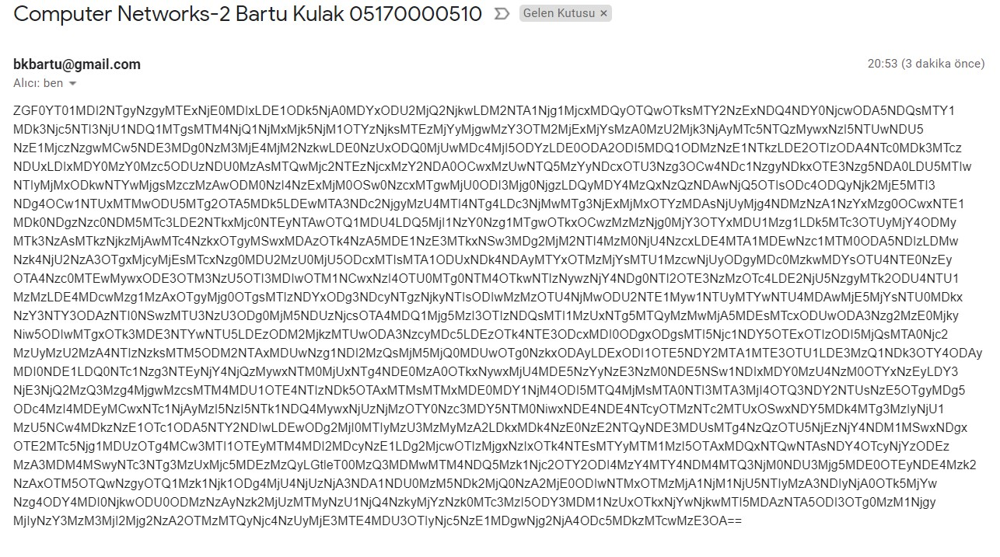
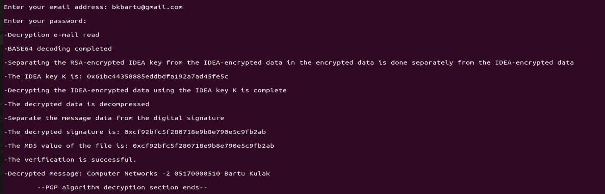

## Computer Networks - 2 Final Project
# E-Mail Secure System with PGP


## Usage
```cmd
python3 main.py
 ```
### After run the code:
*PGP Encryption Section start*



after encryption it's wait for input. Senders e-mail address, sender e-mail address's password, receivers e-mail address. Then mail will be send.
An example for mail:



*PGP Encryption Section ends*

*PGP Decryption Section start*



After mail sent decryption section will be start. It ask for receivers mail address and password for reading encrypted message from mail sended in encryption section. Then decrypt the message and write decrypted message to terminal.

*PGP Decryption Section ends*

## CODES:

```main.py``` : This is used for generate IDEA keys, RSA public, private keys and run the server and client codes. Source file (file.txt) includes the message desired to send with e-mail. 

```server.py``` : This is used for encrypt the message and send it with e-mail.

```send.py``` : This is used for send the e-mail with SMTP. E-mail subject is defined "Computer Networks-2 Bartu Kulak 05170000510".

```client.py``` : This is used for the decrypt the data received from e-mail.

```receive.py``` : This is used for the receive e-mail with IMAP. Receive the message from mail with the subject "Computer Networks-2".

```myIDEA.py``` : This is the method used for IDEA encryption.

```myMD5.py``` : This is the method used for hashing.

```myRSA.py``` : This is the method used for RSA encryption


